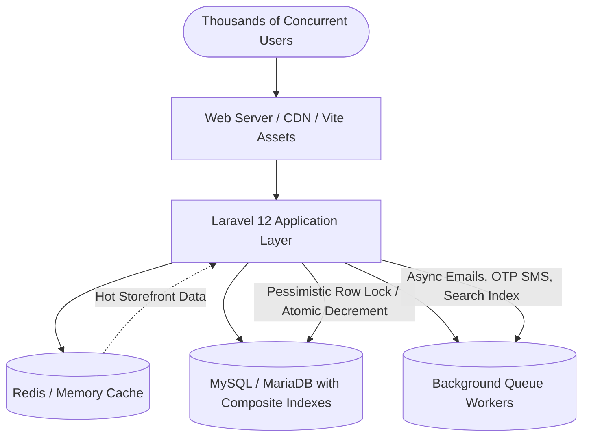

# High-Concurrency Daraz-Style Laravel Ecommerce Architecture & Implementation Plan

A full-featured, high-throughput ecommerce platform modeled after Daraz (Bangladesh's leading marketplace), designed to smoothly handle thousands of concurrent users browsing, adding to cart, and placing orders during peak shopping events (e.g., 11.11 Flash Sales) without performance degradation.

---

## 1. High-Concurrency & Scalability Architecture

To ensure the platform can handle thousands of simultaneous users without slowdowns or database lockups, the application will adhere to these core architectural pillars:



### 1.1 Atomic Inventory Concurrency (Anti-Overselling Engine)
- **Problem**: When thousands of users attempt to purchase the same hot item during a flash sale, standard Eloquent checks (`if ($stock >= $qty)`) cause race conditions and negative inventory.
- **Solution**: 
  1. Atomic SQL conditional decrement:
     ```php
     $affected = DB::table('product_variants')
         ->where('id', $variantId)
         ->where('stock', '>=', $quantity)
         ->decrement('stock', $quantity);
     if ($affected === 0) {
         throw new OutOfStockException("Item is no longer available in this quantity.");
     }
     ```
  2. For multi-item carts, wrapped in a strict database transaction with row-level `lockForUpdate()` on variant/product records.

### 1.2 Multi-Tier Caching & Invalidation
- **Category Tree & Mega Menu**: Cached for 24h (`Cache::rememberForever('store_category_tree', ...)`), invalidated via Eloquent model observers upon any Category save/update/delete.
- **Site Settings & Active Brands**: Pre-warmed and cached permanently, cleared only on administrative changes.
- **Flash Deals & Top Selling Feeds**: Cached with short TTL (3-5 minutes) with tag support.
- **Zero N+1 Query Guarantee**: All product listing queries strictly enforce eager loading (`with(['images', 'brand', 'variants', 'reviews'])`) and aggregate counts (`withCount('reviews')`).

### 1.3 Database Indexing & Query Tuning
- Every foreign key indexed.
- Composite indexes on query bottlenecks:
  - `products`: `(is_active, category_id, created_at)`, `(is_active, brand_id)`, `(is_active, price)`, `(is_featured, is_active)`
  - `product_variants`: `(product_id, stock)`
  - `orders`: `(user_id, created_at)`, `(status, created_at)`
  - `cart_items`: `(cart_id, product_id, product_variant_id)`
  - `categories`: `(parent_id, is_active, sort_order)`
- Column projection: Select only needed columns for card listings to reduce I/O overhead.

### 1.4 Asynchronous Background Processing
- Heavy operations are decoupled from HTTP request cycles:
  - SMS OTP delivery via background queue job.
  - Order confirmation emails & notifications.
  - Payment gateway IPN/webhook processing and reconciliation.
  - Invoice PDF generation.

---

## 2. Target Database Schema (21 Tables)

All migrations will use `unsignedBigInteger` foreign keys, cascades where appropriate, and 191-character string indexing defaults compatible with MariaDB/MySQL.

1. **`users`**: `id`, `name`, `email` (unique), `phone` (unique, nullable), `phone_verified_at` (nullable), `password`, `avatar` (nullable), `status` (active/inactive), `remember_token`, `timestamps`.
2. **`admins`**: `id`, `name`, `email` (unique), `password`, `is_active` (boolean), `remember_token`, `timestamps`.
3. **`categories`**: `id`, `parent_id` (foreign nullable references categories.id on delete cascade), `name`, `slug` (unique), `icon`, `image`, `sort_order` (integer default 0), `is_active` (boolean default true), `timestamps`.
4. **`brands`**: `id`, `name`, `slug` (unique), `logo` (nullable), `is_active` (boolean default true), `timestamps`.
5. **`products`**: `id`, `category_id` (foreign), `brand_id` (foreign nullable), `title`, `slug` (unique), `sku` (unique), `price` (decimal 10,2), `sale_price` (decimal 10,2 nullable), `stock` (integer default 0), `short_description` (text nullable), `description` (longText nullable), `specifications` (json nullable), `is_active` (boolean default true), `is_featured` (boolean default false), `rating_avg` (decimal 3,2 default 0.00), `reviews_count` (integer default 0), `timestamps`.
6. **`product_images`**: `id`, `product_id` (foreign on delete cascade), `image_path`, `is_primary` (boolean default false), `sort_order` (integer default 0), `timestamps`.
7. **`attributes`**: `id`, `name` (e.g., Color, Size), `code` (slug), `timestamps`.
8. **`attribute_values`**: `id`, `attribute_id` (foreign on delete cascade), `value` (e.g., Red, XL), `meta` (nullable color hex or note), `timestamps`.
9. **`product_variants`**: `id`, `product_id` (foreign on delete cascade), `sku` (unique), `price` (decimal 10,2 nullable), `sale_price` (decimal 10,2 nullable), `stock` (integer default 0), `image_path` (nullable), `attributes` (json store of selected attribute value IDs), `timestamps`.
10. **`carts`**: `id`, `user_id` (foreign nullable on delete cascade), `session_token` (string index nullable), `timestamps`.
11. **`cart_items`**: `id`, `cart_id` (foreign on delete cascade), `product_id` (foreign on delete cascade), `product_variant_id` (foreign nullable on delete cascade), `quantity` (integer unsigned), `price` (decimal 10,2), `timestamps`.
12. **`addresses`**: `id`, `user_id` (foreign on delete cascade), `name`, `phone`, `division`, `district`, `upazila`, `address_line`, `is_default_shipping` (boolean default false), `is_default_billing` (boolean default false), `type` (home/office), `timestamps`.
13. **`orders`**: `id`, `order_number` (string unique), `user_id` (foreign nullable), `status` (`pending`, `processing`, `shipped`, `delivered`, `cancelled`, `returned`), `subtotal` (decimal 10,2), `discount` (decimal 10,2 default 0), `shipping_fee` (decimal 10,2 default 0), `total` (decimal 10,2), `payment_method` (e.g. `sslcommerz`, `cod`), `payment_status` (`unpaid`, `paid`, `refunded`), `shipping_address` (json), `billing_address` (json nullable), `notes` (text nullable), `timestamps`.
14. **`order_items`**: `id`, `order_id` (foreign on delete cascade), `product_id` (foreign nullable), `product_variant_id` (foreign nullable), `product_title` (string), `variant_title` (string nullable), `price` (decimal 10,2), `quantity` (integer unsigned), `total` (decimal 10,2), `timestamps`.
15. **`payments`**: `id`, `order_id` (foreign on delete cascade), `gateway` (sslcommerz, stripe, cod), `transaction_id` (string nullable index), `amount` (decimal 10,2), `currency` (string default 'BDT'), `status` (`initiated`, `completed`, `failed`, `cancelled`), `payload` (json nullable), `timestamps`.
16. **`coupons`**: `id`, `code` (string unique), `type` (`fixed`, `percentage`), `value` (decimal 10,2), `min_spend` (decimal 10,2 nullable), `max_discount` (decimal 10,2 nullable), `usage_limit` (integer nullable), `used_count` (integer default 0), `starts_at` (dateTime nullable), `expires_at` (dateTime nullable), `is_active` (boolean default true), `timestamps`.
17. **`reviews`**: `id`, `user_id` (foreign on delete cascade), `product_id` (foreign on delete cascade), `order_id` (foreign nullable), `rating` (tinyInteger unsigned 1-5), `comment` (text nullable), `is_verified_purchase` (boolean default false), `status` (`approved`, `pending`, `rejected`), `timestamps`.
18. **`review_images`**: `id`, `review_id` (foreign on delete cascade), `image_path`, `timestamps`.
19. **`wishlists`**: `id`, `user_id` (foreign on delete cascade), `product_id` (foreign on delete cascade), `timestamps`. Unique constraint `(user_id, product_id)`.
20. **`otp_codes`**: `id`, `phone` (string index), `code` (string 6), `action` (string default 'register'), `expires_at` (dateTime), `verified_at` (dateTime nullable), `attempts` (tinyInteger default 0), `timestamps`.
21. **`settings`**: `id`, `key` (string unique), `value` (text nullable), `group` (string default 'general'), `timestamps`.

---

## 3. Development Roadmap (10 Sequential Phases)

Each phase will be fully functional and verifiable before proceeding to the next.

### Phase 1: Project Skeleton, Customer Auth & Separate Admin Panel
- Configure `Admin` model & migration with separate authentication guard `admin` (`config/auth.php`).
- Wire Filament Admin Panel at `/admin` using `authGuard('admin')` so administrative sessions and customer sessions are completely independent.
- Seed the primary administrator account (`admin@daraz.local`).
- Configure customer authentication using Laravel Breeze with styled Daraz aesthetic (warm orange accent `#F85606`).
- Create and maintain root `PROGRESS.md` following the mandatory format.

### Phase 2: Catalog Management in Filament (Category, Brand, Variants, Products)
- Implement `CategoryResource` with hierarchical tree support (parent/child categories) and automatic slugging.
- Implement `BrandResource` with logo upload.
- Implement `AttributeResource` and `AttributeValueResource` (Color, Size, Material).
- Implement `ProductResource` with:
  - SKU, dynamic pricing, sale price, inventory management.
  - Multi-image gallery with primary thumbnail selector.
  - Dynamic variant generator/manager with individual variant SKU, price override, and stock tracking.
  - Specifications table builder (key-value JSON).

### Phase 3: Public Storefront (Daraz Aesthetic)
- Master Layout with Daraz header:
  - Top bar (Save More on App, Help & Support, Account links).
  - Main header: Daraz orange `#F85606`, branding logo, centered wide search input, wishlist & cart counter badges.
  - Responsive navigation bar with mega-menu category dropdown.
- **Home Page**:
  - Banner hero carousel.
  - Category icon grid.
  - Flash Sale section with countdown timer and stock progress bars.
  - "Just For You" dynamic product grid with responsive 4-column cards.
- **Category & Search Listing Page**:
  - Left sidebar collapsible filter engine (nested categories, brands, price slider, rating filter, colors/sizes).
  - Right product grid with sorting (Popularity, Price Low/High, Rating, Newest).
- **Single Product Details Page**:
  - Left interactive image gallery with zoom and thumbnail switcher.
  - Right buy box: title, brand, rating summary, price with struck-through original price and % discount, variant selectors (color swatches, size buttons), stock availability, quantity counter, "Buy Now" and "Add to Cart" action buttons.
  - Delivery estimate box & seller guarantee block.
  - Tabbed product description, technical specifications table, verified customer reviews summary with 5-star breakdown bar charts.

### Phase 4: Cart Service & Interactive Wishlist
- Build `App\Services\CartService`:
  - Session-based for guests, database-backed for logged-in users.
  - Seamless automatic cart merger upon user login.
  - Variant-aware (item distinct by `product_id` + `variant_id`).
  - Stock validation during add/update operations.
- Interactive Livewire/Alpine Cart Drawer & Full Cart Page:
  - Instant quantity stepper (+ / -), item removal, real-time subtotal calculation.
- Customer Wishlist toggle with instant feedback badge counters.

### Phase 5: Checkout Engine, Address Book & Atomic Order Placement
- Multi-step or streamlined Daraz-style checkout page:
  - Shipping address selection & modal to add new address (Division, District, Thana/Upazila, Street Address).
  - Delivery method selector (Standard Delivery with guaranteed delivery date estimate).
  - Order summary sidebar displaying Subtotal, Shipping, Coupon Discount, and Grand Total.
- **Atomic Order Placement Action (`PlaceOrderAction`)**:
  - DB transaction with `lockForUpdate()` preventing any race condition overselling.
  - Generates unique order number (e.g., `ORD-20260909-XXXX`).
  - Creates `order` and `order_items`.
  - Clears purchased items from the active cart.

### Phase 6: SSLCommerz Payment Gateway & Multi-Gateway Architecture
- Create `App\Contracts\PaymentGatewayInterface`:
  - `initiatePayment(Order $order): PaymentRedirectUrl`
  - `handleCallback(Request $request): PaymentResult`
  - `handleIpn(Request $request): bool`
- Implement `SslCommerzPaymentGateway` (Sandbox & Live support for bKash, Nagad, Rocket, Visa/Mastercard, Amex).
- Stripe Gateway adapter skeleton implementing the same interface.
- Dedicated success, fail, and cancel feedback pages with Daraz branding.

### Phase 7: Mobile OTP Verification Service
- Create `App\Services\OtpService` with pluggable SMS provider driver (Local BD SMS Gateway / Mock for local dev).
- 6-digit cryptographic OTP generation with 3-minute expiry and attempt throttling.
- Phone number verification for customer registration and optional guest checkout verification.

### Phase 8: Filament Order Management & Customer Order History
- Filament `OrderResource`:
  - Status transition workflow (`pending` -> `processing` -> `shipped` -> `delivered` / `cancelled`).
  - Printable invoice/packing slip view.
  - Payment details badge and customer address display.
- Customer Storefront Dashboard:
  - "My Orders" tab with status tracking pills, order details modal, and re-order button.

### Phase 9: Verified Purchase Reviews & Ratings System
- Review submission form accessible only for verified delivered orders.
- Star rating (1 to 5) + text review + customer photo upload.
- Filament moderation resource (`ReviewResource`) for approval/spam control.
- Auto-recalculation of `rating_avg` and `reviews_count` on `products` table via cached event listeners.

### Phase 10: Coupons, Live Search & Final Polish
- Coupon system: Percentage/Fixed discounts, minimum spend validation, expiry date checks, usage limits per customer.
- Livewire search bar with instant dropdown debounced search (product title, category, brand, image thumbnails).
- Full responsiveness audit (Mobile, Tablet, Desktop) and speed optimization.

---

## 4. Proposed File Structure for Phase 1

### Models & Migrations
- `database/migrations/xxxx_create_admins_table.php` [NEW]
- `database/migrations/xxxx_create_categories_table.php` [NEW]
- `database/migrations/xxxx_create_brands_table.php` [NEW]
- `database/migrations/xxxx_create_attributes_table.php` [NEW]
- `database/migrations/xxxx_create_attribute_values_table.php` [NEW]
- `database/migrations/xxxx_create_products_table.php` [NEW]
- `database/migrations/xxxx_create_product_images_table.php` [NEW]
- `database/migrations/xxxx_create_product_variants_table.php` [NEW]
- `database/migrations/xxxx_create_carts_table.php` [NEW]
- `database/migrations/xxxx_create_cart_items_table.php` [NEW]
- `database/migrations/xxxx_create_addresses_table.php` [NEW]
- `database/migrations/xxxx_create_orders_table.php` [NEW]
- `database/migrations/xxxx_create_order_items_table.php` [NEW]
- `database/migrations/xxxx_create_payments_table.php` [NEW]
- `database/migrations/xxxx_create_coupons_table.php` [NEW]
- `database/migrations/xxxx_create_reviews_table.php` [NEW]
- `database/migrations/xxxx_create_review_images_table.php` [NEW]
- `database/migrations/xxxx_create_wishlists_table.php` [NEW]
- `database/migrations/xxxx_create_otp_codes_table.php` [NEW]
- `database/migrations/xxxx_create_settings_table.php` [NEW]
- `app/Models/Admin.php` [NEW]
- `app/Models/Category.php` [NEW]
- `app/Models/Brand.php` [NEW]
- `app/Models/Product.php` [NEW]
- `app/Models/ProductImage.php` [NEW]
- `app/Models/ProductVariant.php` [NEW]
- `app/Models/Attribute.php` [NEW]
- `app/Models/AttributeValue.php` [NEW]
- `app/Models/Cart.php` [NEW]
- `app/Models/CartItem.php` [NEW]
- `app/Models/Address.php` [NEW]
- `app/Models/Order.php` [NEW]
- `app/Models/OrderItem.php` [NEW]
- `app/Models/Payment.php` [NEW]
- `app/Models/Coupon.php` [NEW]
- `app/Models/Review.php` [NEW]
- `app/Models/ReviewImage.php` [NEW]
- `app/Models/Wishlist.php` [NEW]
- `app/Models/OtpCode.php` [NEW]
- `app/Models/Setting.php` [NEW]

### Auth & Configuration
- `config/auth.php` [MODIFY] - Add `admin` guard and `admins` provider.
- `app/Providers/Filament/AdminPanelProvider.php` [MODIFY] - Set `authGuard('admin')`.
- `PROGRESS.md` [NEW] - Tracking file at project root.

---

## 5. Verification Plan

### Database & Auth Verification
- Run database migrations cleanly (`php artisan migrate`).
- Run seeder to establish default admin (`admin@daraz.local / password`) and sample categories/brands.
- Verify admin panel login at `http://127.0.0.1:8000/admin` authenticating through `admins` table.
- Verify customer registration and login at `http://127.0.0.1:8000/register` and `/login` authenticating through `users` table.
- Verify simultaneous sessions: Admin logged in on `/admin` while customer logged in on storefront without interference.
